# 🔐 PassX – Password Manager

**PassX** is a secure, modern password manager built with React, Node.js, Express, and SQL. It lets users store, organize, and manage passwords securely in a user-friendly vault interface.

---

## 🚀 Features

- 🔒 Secure password encryption and storage
- 🧠 Real-time password strength checker
- 🔐 Password generator
- 📁 Categorized password vault
- 📋 Copy-to-clipboard functionality
- 🔐 JWT-based user authentication
- 🛡️ Bcrypt password hashing

---
### 🔐 Login Page
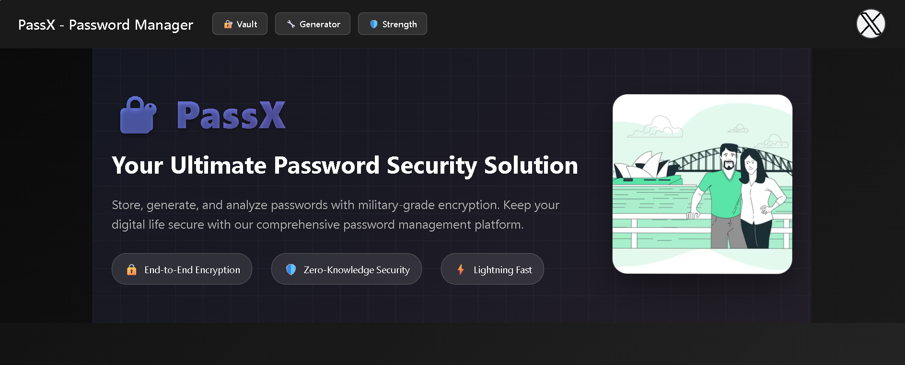

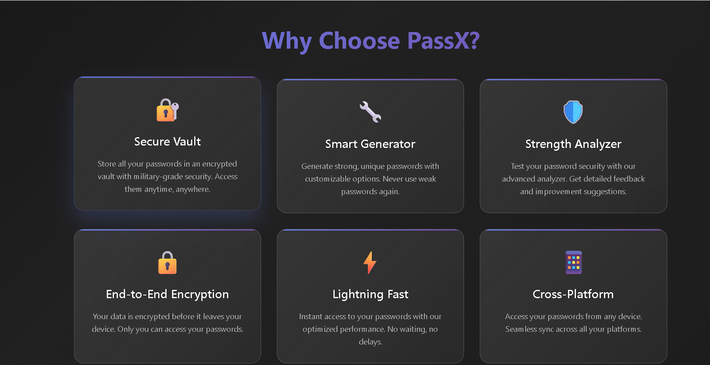

---
### 📝 Signup Page
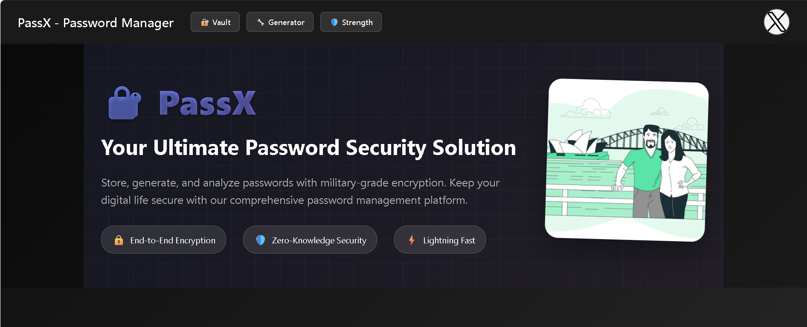
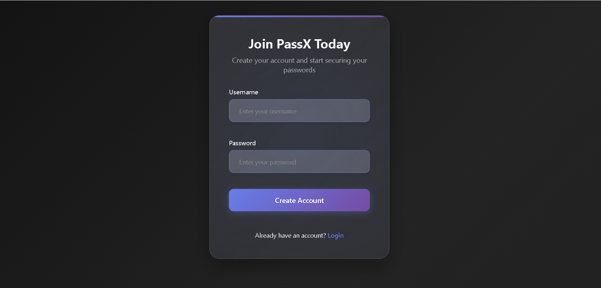

---

### 🏠 Home Page
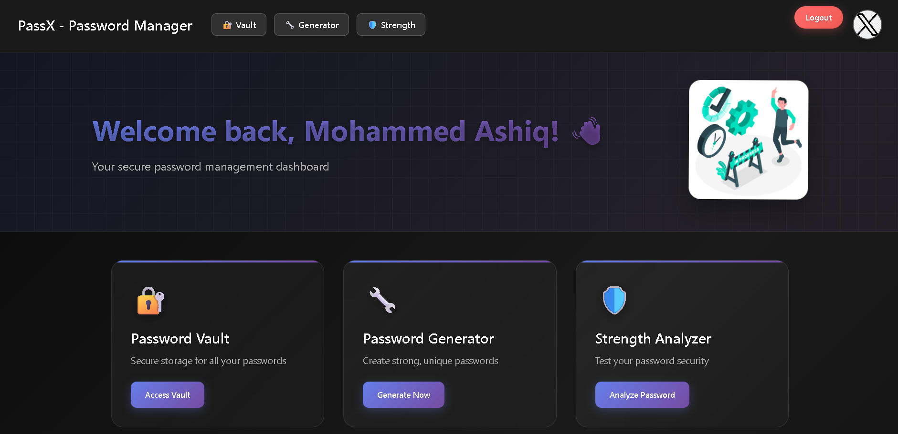
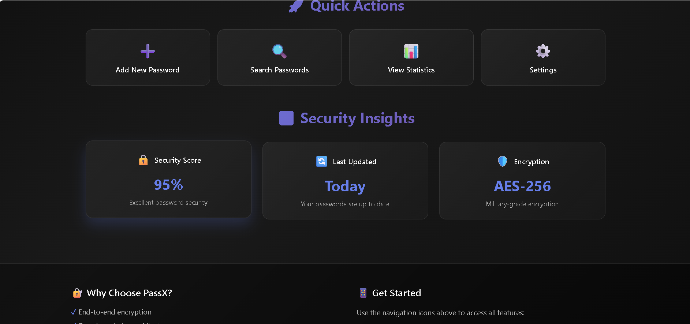

---

### 🛡️ Vault Page
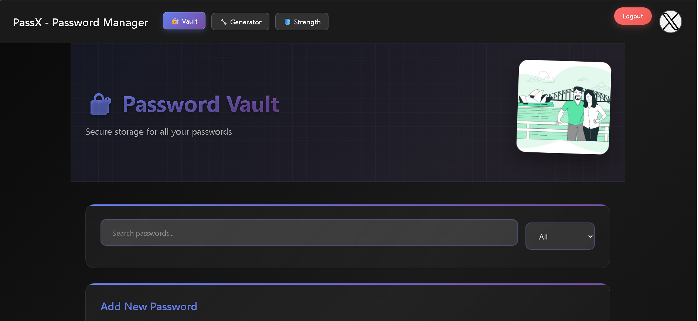
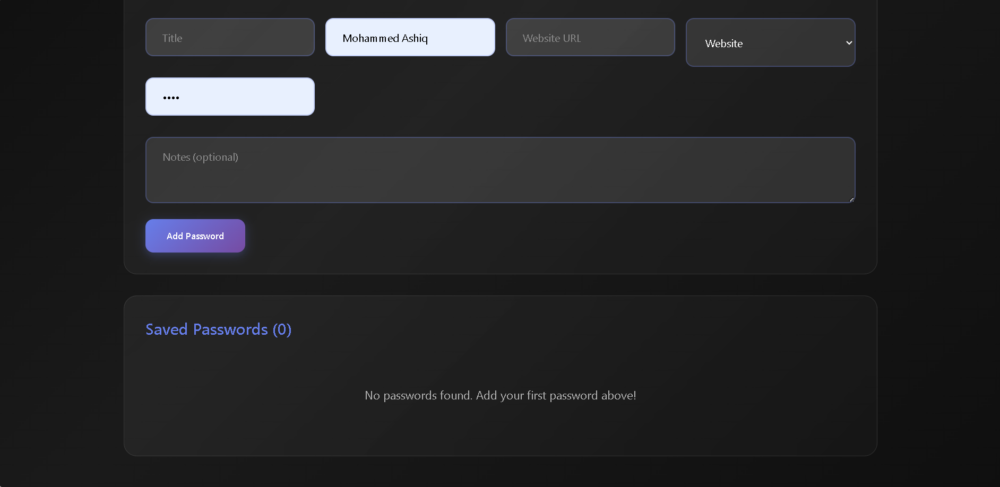

---

### ⚙️ Password Generator
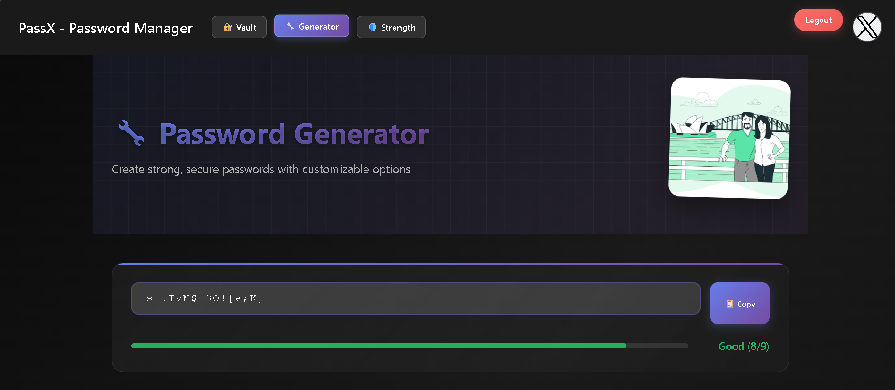
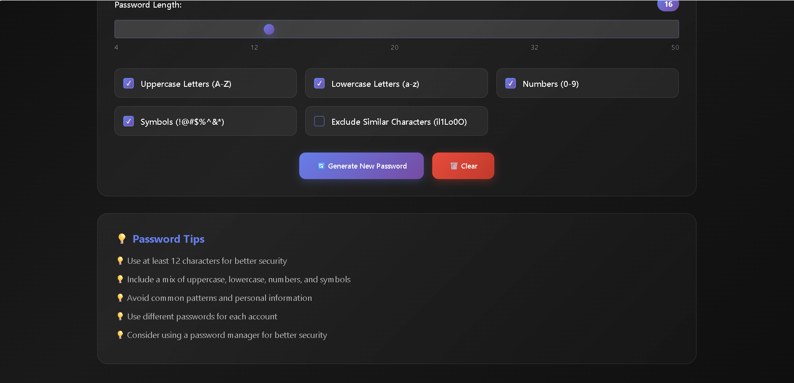

---

### 📊 Password Analyzer
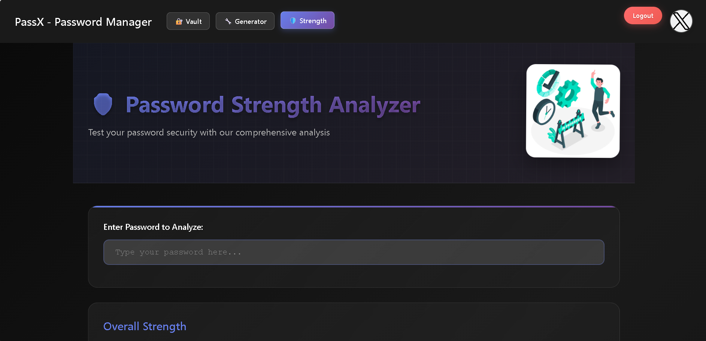
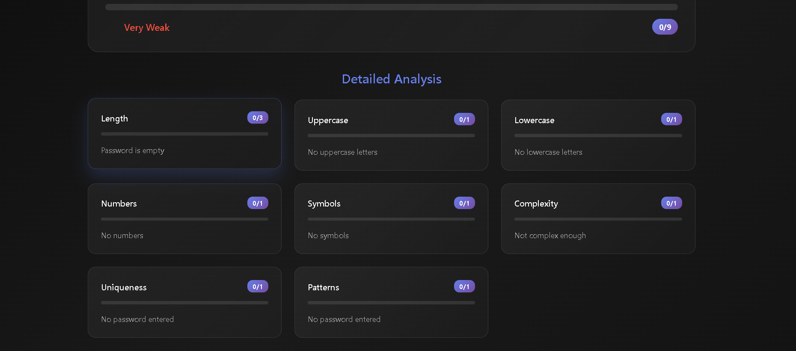

